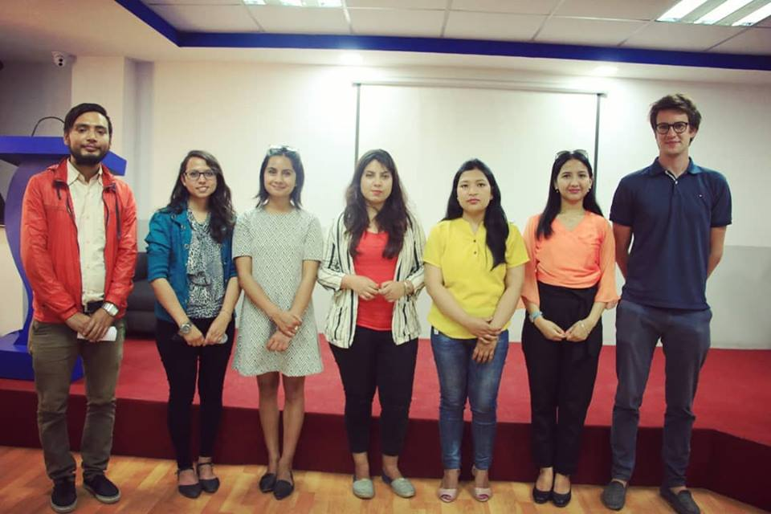

```{r setup, include=FALSE}
knitr::opts_chunk$set(echo = TRUE)
```

## R-Ladies Kathmandu

R-Ladies Kathmandu hosted meetup in September 25th, 2018.

We talked about our shared mission, and how can we improve our R-Ladies Group at our place.

